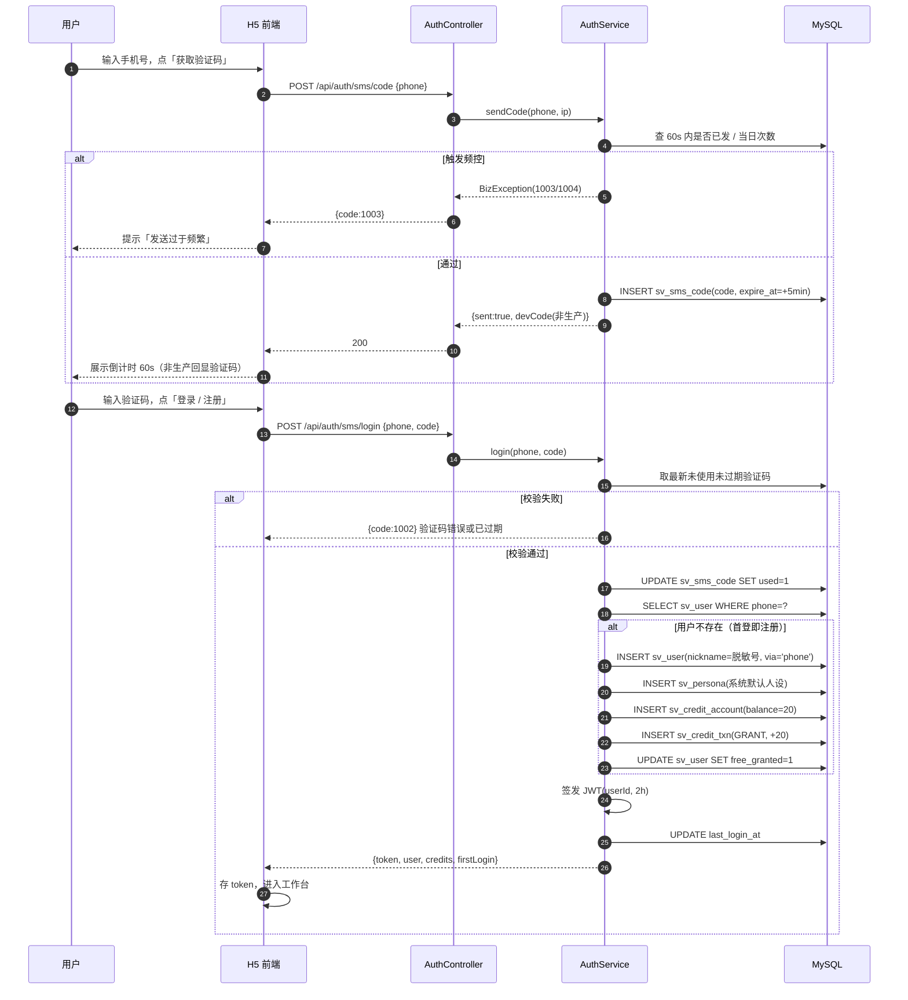
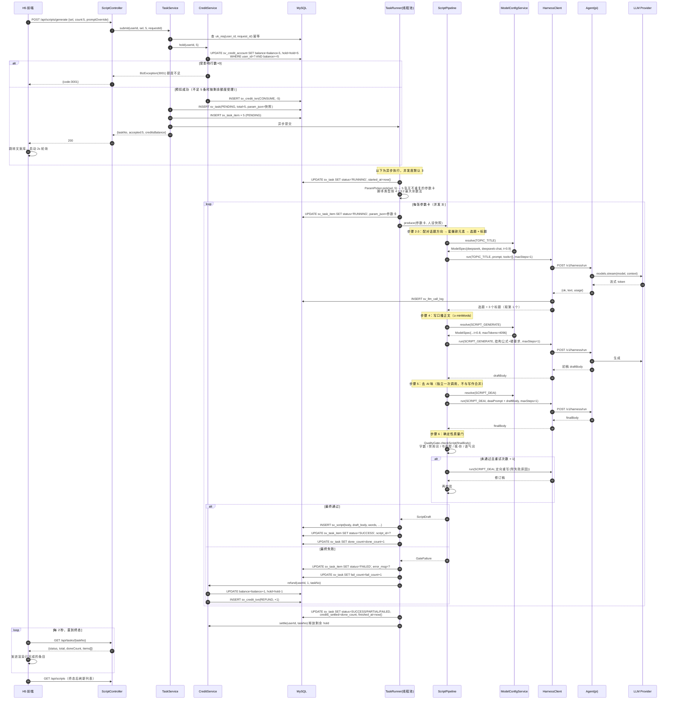
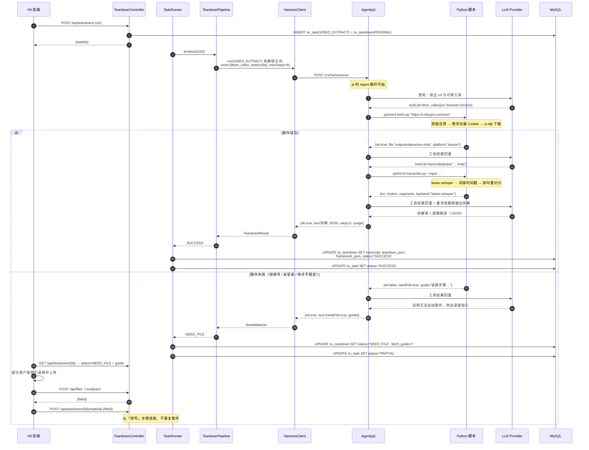
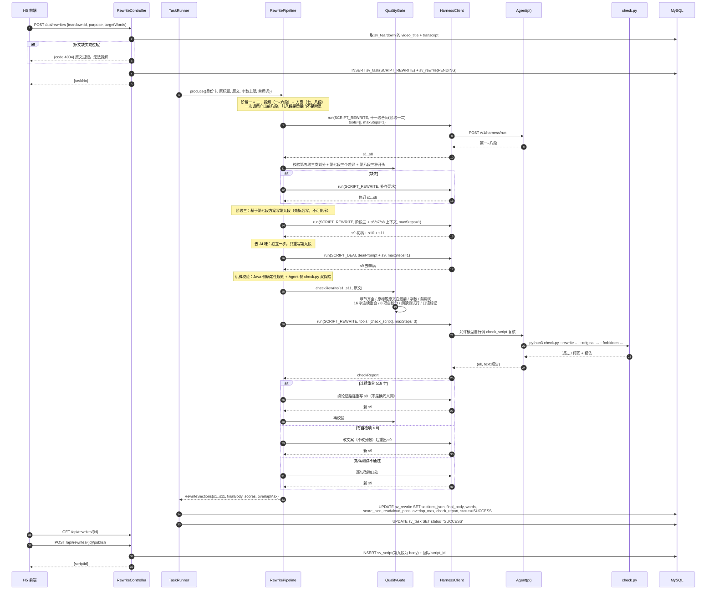
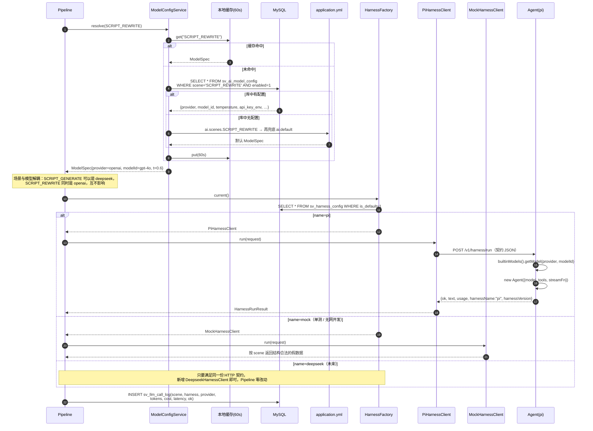
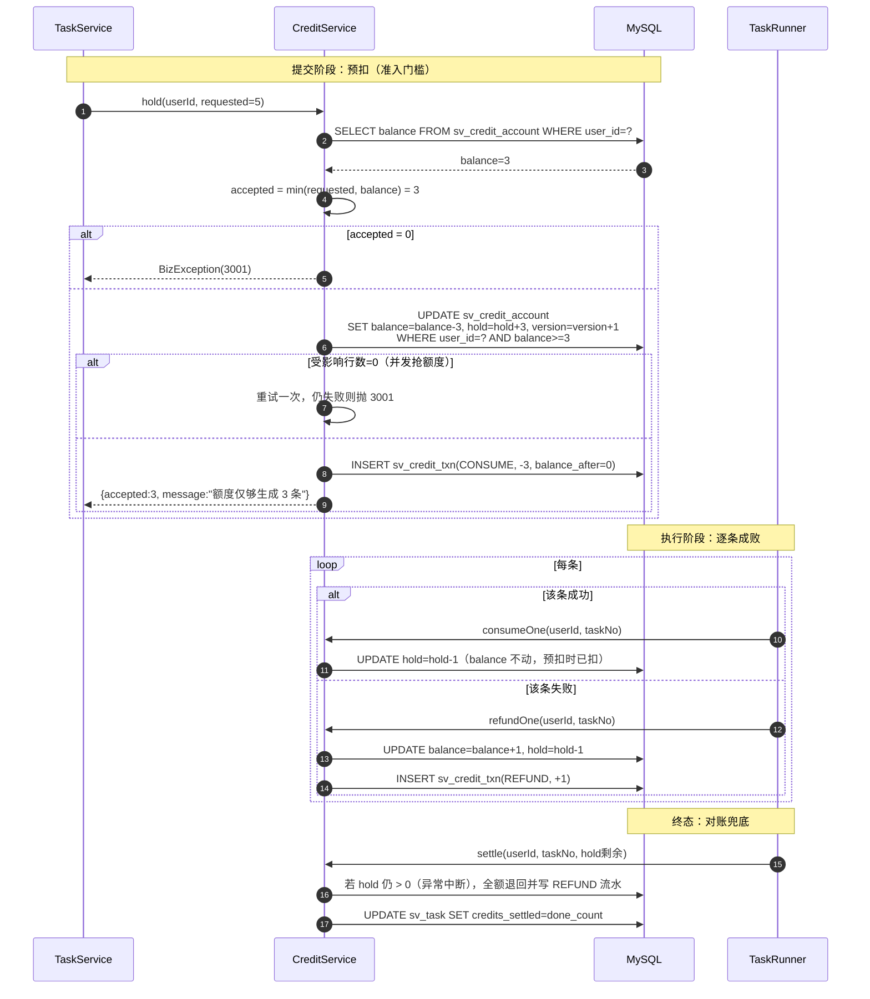

# 闪创工厂 · 详细设计

| 项目 | 内容 |
| --- | --- |
| 文档版本 | v1.0 |
| 关联 | 《功能需求说明》《系统架构设计》《数据库设计》《接口设计》 |
| 时序图 | Mermaid `sequenceDiagram`，可在支持 Mermaid 的编辑器直接渲染 |

---

## 1. 领域模型与职责

### 1.1 `workflow` 包（领域核心，不依赖 Spring Web / DB）

```
workflow/
├── model/
│   ├── WizardSel          向导参数（各字段为多选数组）
│   ├── ParamCard           单条参数卡（抽取后的具体值）
│   ├── PersonaSnapshot     人设快照
│   ├── ScriptDraft         初稿/终稿 + 字数 + 命中项
│   └── RewriteSections     十一段
├── ParamPicker             参数抽取：4:1:3:2 + 批内去重
├── PromptBuilder           七步法提示词 / 十一段合同 / 去 AI 味
├── QualityGate             确定性校验（字数/禁用词/重合/章节/口语）
├── ScriptPipeline          写作 → 去味 → 校验
├── RewritePipeline         三阶段十一段 → 校验 → 去味 → 朗读
└── TeardownPipeline        取件 → 转写 → 拆解
```

三个 Pipeline 都以 `HarnessPort`（`workflow` 自己定义的窄接口）调模型，由外层注入 `HarnessClient` 适配。这样 Pipeline 的单元测试只需一个 lambda 返回固定文本，不需要 Spring、不需要网络。

```java
@FunctionalInterface
public interface HarnessPort {
    String run(Scene scene, String systemPrompt, List<Msg> messages,
               List<String> tools, int maxSteps);
}
```

### 1.2 关键类职责

| 类 | 职责 | 关键方法 |
| --- | --- | --- |
| `ParamPicker` | 把 `WizardSel` 展开成 N 张互不重复的参数卡 | `List<ParamCard> pick(WizardSel, int n, OptionCatalog, long seed)` |
| `PromptBuilder` | 拼装各场景提示词 | `topicTitlePrompt` / `bodyPrompt` / `deaiPrompt` / `rewriteContract` |
| `QualityGate` | 复刻 `check.py` 的确定性规则 | `GateResult checkScript(...)` / `checkRewrite(...)` |
| `ScriptPipeline` | 单条文案的完整生产 | `ScriptDraft produce(ParamCard, PersonaSnapshot)` |
| `RewritePipeline` | 十一段合同执行 | `RewriteSections produce(RewriteInput)` |
| `TeardownPipeline` | 拆解 | `TeardownResult produce(TeardownInput)` |
| `TaskRunner` | 异步任务调度、进度更新、额度结算 | `submit` / `execute` |
| `ModelConfigService` | 按场景解析模型配置（带缓存） | `ModelSpec resolve(Scene)` |
| `HarnessClient` | harness SPI | `run` / `health` / `name` |

---

## 2. 核心算法

### 2.1 脚本类型 4:1:3:2 —— 最大余数法

Skill 明确要求批量必须严格按配比，模型自行随机会偏离。纯随机在 N=10 时方差很大，所以用确定性分配 + 洗牌。

```
输入：n = 10，权重 w = [痛点科普 4, Vlog 1, 聊天 3, 话题 2]，总权重 W = 10
1. 精确份额 q_i = n * w_i / W        → [4.0, 1.0, 3.0, 2.0]
2. 整数部分 f_i = floor(q_i)         → [4, 1, 3, 2]，已分配 10
3. 余额 r = n - Σf_i = 0             → 无需补
4. 若 r > 0，按小数部分 (q_i - f_i) 降序补 1，平手时按权重降序
5. 展开成长度 n 的数组后 Fisher-Yates 洗牌
```

`n=15` 时：`q = [6.0, 1.5, 4.5, 3.0]` → `f = [6,1,4,3]` 共 14，余 1 → 小数部分 Vlog 0.5 与聊天 0.5 平手，按权重降序给聊天 → `[6,1,5,3]`。

> 这个平手规则很重要：早期版本按遍历顺序补位，导致两批 15 条永远得到 12/2/10/6，永远凑不出 12/3/9/6。用「小数降序 + 权重降序」打破平手后，跨批次配比才稳定。

用户显式选了脚本类型时，只在所选集合内按同样方法分配。

### 2.2 批内去重

一批里出现两条讲同一件事就是失败的批量。去重键取**参数组合**：

```
key = topicType | source | inner | middle | outer | element | scriptType
```

抽取时最多重试 `n * 8` 次找不重复的键；候选空间不足（如用户只选了 1 个中圈 + 1 个外圈却要 20 条）时允许重复，但保证**相邻两条不同**，并在任务里标记 `dedupRelaxed=true` 供前端提示。

### 2.3 中文字数统计

```java
public static int cnWords(String s) {
    if (s == null) return 0;
    String t = s.replaceAll("\\s+", "");
    return t.codePointCount(0, t.length());   // 不用 length()，避免 emoji 代理对算 2
}
```

### 2.4 与原文连续重合检测（≥16 字失败）

`check.py` 的规则是「与原文连续重合 ≥16 字视为失败」。朴素双循环是 O(n·m·L)，原文 900 字、洗稿 600 字时约 5×10⁵ 次比较——能跑但没必要。用**定长窗口哈希**做到 O(n+m)：

```
1. 两侧都先归一化：去空白、去标点、繁简不转（保持原样）
2. 对原文所有长度为 16 的窗口求滚动哈希，存入 HashSet
3. 扫洗稿的每个 16 长窗口，命中则用 equals 二次确认（防哈希碰撞）
4. 命中即失败，并继续向右扩张求出最长重合长度 overlapMax 用于审计
```

窗口长度 16 是阈值本身，所以「存在 ≥16 的重合」等价于「存在某个 16 长窗口重合」，无需枚举更长窗口。

### 2.5 书面腔与口语标记检测

复刻 `check.py` 的警告规则：

| 检查 | 规则 | 命中后 |
| --- | --- | --- |
| 书面腔 | 命中 `至关重要` / `核心竞争力` / `不可或缺` / `发展趋势表明` 等词表 | 整句重写 |
| 人称 | 正文须同时出现「我」和「你」 | 缺则警告并重写 |
| 语气词 | 须出现 `对吧` / `其实啊` / `你知道吗` / `咱们` 等至少一个 | 缺则警告 |
| 朗读测试 | 第十一段末尾须有「朗读测试通过 / 不通过」 | 缺则打回 |
| 禁用词 | 人设 `banned` + 请求 `extraBanned` | 命中即失败 |
| 章节 | 十一段 `一、`…`十一、` 齐全 + 原视频标题 + 原视频文案 | 缺则打回 |
| 字数 | `minWords ≤ w ≤ maxWords` | 越界则打回 |
| 自检分 | 8 项均 ≥ 8 | 有低分则打回 |

---

## 3. 时序图

### 3.1 手机号登录（首登即注册）



### 3.2 批量生成文案（核心链路）

这是整个系统最重要的一条链路，把 Skill 的七步法落成可执行的编排。注意**写作与去 AI 味是两次独立的模型调用**。



### 3.3 爆款拆解（含取件失败分支）



`fetch_video` 失败时**不重试、不换第三方解析站**——这是 Skill 的合规底线，直接给录屏指引。

### 3.4 文案重写 · 十一段合同



### 3.5 模型解析与 Harness 替换

这张图说明「模型可配置可替换」与「harness 可替换」是两个独立维度。



### 3.6 额度预扣与结算



---

## 4. 状态机

### 4.1 任务 `sv_task.status`

```
        submit
          │
          ▼
      ┌───────┐  runner 取任务   ┌─────────┐
      │PENDING│ ───────────────► │ RUNNING │
      └───┬───┘                  └────┬────┘
          │ cancel                    │ 全部子项终态
          ▼                           ▼
    ┌───────────┐        ┌────────────┼────────────┐
    │ CANCELLED │        ▼            ▼            ▼
    └───────────┘   ┌─────────┐  ┌─────────┐  ┌────────┐
                    │ SUCCESS │  │ PARTIAL │  │ FAILED │
                    └─────────┘  └─────────┘  └────────┘
                    fail=0        0<done      done=0
```

终态不可再变更；对终态任务调 cancel 返回 `3004`。

### 4.2 拆解 `sv_teardown.status`

```
PENDING ──取件成功──► （转写）──► SUCCESS
   │
   ├──取件失败且平台不支持──► NEED_FILE ──用户上传素材──► PENDING（从转写续跑）
   │
   └──转写/拆解异常──► FAILED
```

`NEED_FILE` 不是失败：视频号本就只能录屏，抖音也可能因浏览器未登录失败，此时等用户补素材。

---

## 5. 提示词构造

### 5.1 生成正文（`SCRIPT_GENERATE`）

`PromptBuilder.bodyPrompt` 严格按 Skill 步骤 4 的九条硬要求组织：

```
System:
  你现在是一名资深的短视频文案写手，写文案前会搜罗分析同选题的高赞视频做参考，
  再按脚本结构撰写口播文案。全程口语化，多用「我」和「你」，一句话只讲一件事，
  写完能读出声、你奶奶也听得懂。只要纯文案，不要画面，不低于 {minWords} 字。

User:
  【人设】{model}｜{identity}
  【价值定位】{value}
  【目标人群】{audience}
  【表达风格】{tone}

  【选题类型】{topicType}类选题
  【选题来源】{source}
  【25 宫格配对】{inner} × {middle} × {outer}
  【爆款元素】{element}
  【选题】{topic}
  【标题】{title}

  【脚本类型】{scriptType}
  【结构公式】{formula}

  【硬性要求】
  1. 按结构公式走，不要拿痛点科普的编号并列去套其他三类
  2. 正文不低于 {minWords} 字
  3. 只要纯口播文案，不要分镜、画面描述、运镜说明
  4. 开头 3 秒用实景开场 / 共情提问 / 反常识观点之一，且与正文强相关
  5. 中段每 50-75 字埋一个钩子点，{minWords} 字至少 3 个
  6. 70% 篇幅只讲 1-2 个核心点，其余一笔带过
  7. 通篇「我」和「你」，带语气词，一句话只讲一件事
  8. 软引导按「{ctaStyle}」只放结尾，不超过全文 10%
  9. 数据给区间或给出处，主动说清代价与门槛

  【硬性红线】通篇避开这些词：{banned}
  骨架标记只用于自己组织结构，交付的正文里不保留。
```

用户在向导里手改了提示词时，`promptOverride` 直接替换 User 段。

### 5.2 去 AI 味（`SCRIPT_DEAI`）

原样使用 `skills/short-video-script/references/deai-prompt.md` 的提示词，后接初稿。**不与写作合并**——同一次生成里既写又改，模型会保留自己的表达习惯，这是 Skill 里明确写死的约束。

### 5.3 洗稿（`SCRIPT_REWRITE`）

原样加载 `skills/video-script-rewrite/references/rewrite-prompt.md` 作为合同，把身份卡与原文填入占位符。分两次调用：

| 调用 | 产出 | 原因 |
| --- | --- | --- |
| 第一次 | 一~八段 | 前八段是「先拆后写」的质量门，必须先落定 |
| 第二次 | 九~十一段 | 以第五段三类划分与第七段方案为设计图写正文 |

倒着做（先写正文再补方案）一定像复述，所以顺序在代码里强制，不给模型选择权。

提示词模板作为资源文件放在 `server/src/main/resources/prompts/`，构建时从 `skills/` 同步，保证与 Skill 单一真源。

---

## 6. 并发与线程模型

```java
@Bean("taskExecutor")
ThreadPoolTaskExecutor taskExecutor() {
    var e = new ThreadPoolTaskExecutor();
    e.setCorePoolSize(4);
    e.setMaxPoolSize(8);
    e.setQueueCapacity(200);
    e.setThreadNamePrefix("sc-task-");
    e.setRejectedExecutionHandler(new ThreadPoolExecutor.CallerRunsPolicy());
    return e;
}
```

| 层级 | 并发策略 |
| --- | --- |
| 任务级 | 一个任务占用一个 `taskExecutor` 线程 |
| 条目级 | 任务内用 `Semaphore(3)` 限制同时进行的条目数，避免一批 20 条把 provider 打限流 |
| 用户级 | 进行中任务上限 2 个（接口层校验） |
| 重试 | provider 限流（`PROVIDER_RATE_LIMIT`）指数退避重试 3 次；其它错误不自动重试 |

单条文案要 3 次模型调用（选题标题 + 正文 + 去味），20 条即 60 次。并发 3 时约 20 轮，单轮 ~30s，整批约 10 分钟——所以异步 + 渐进展示是必需的，前端不能等。

---

## 7. 前端设计（H5 1:1 还原）

### 7.1 还原策略

原型的组件与样式**原样复用**，只替换数据层：

| 文件 | 处理 |
| --- | --- |
| `index.css` | 原样复制，设计令牌与 `@theme inline` 不动 |
| `components/*.tsx` | 原样复制，只改 props 来源与事件回调 |
| `lib/palette.ts` | 原样复制 |
| `data/config.ts` | 保留为**兜底默认值**，运行时优先用 `GET /api/options` |
| `lib/generate.ts` | 删除本地假生成，改为 `api.generate()` + 轮询 |
| `data/scripts.ts` | 删除内置样稿，改为 `api.listScripts()` |

### 7.2 新增的前端模块

```
h5/src/
├── api/
│   ├── client.ts      fetch 封装：baseURL、JWT 注入、统一错误、401 跳登录
│   ├── auth.ts  persona.ts  options.ts
│   ├── script.ts      generate / list / detail / delete
│   ├── task.ts        轮询封装（useTaskPolling）
│   ├── teardown.ts  rewrite.ts  credit.ts
├── store/
│   ├── session.ts     token + user，持久化到 localStorage
│   └── toast.ts
└── hooks/
    ├── useOptions.ts      选项缓存（含兜底）
    └── useTaskPolling.ts  2s 轮询 + 终态停止 + 页面隐藏时暂停
```

### 7.3 轮询实现要点

```
启动：submit 成功后拿到 taskNo
间隔：2s；document.hidden 时暂停，可见时立即拉一次
终态：SUCCESS / PARTIAL / FAILED / CANCELLED 停止
渐进：每次响应里 items 中 status=SUCCESS 的条目，把 scriptId 合并进列表
超时：10 分钟未终态则停止轮询并提示「仍在生成，稍后刷新查看」
清理：组件卸载清 interval，避免内存泄漏
```

---

## 8. 单元测试设计

`workflow` 包不依赖 Spring 与网络，是测试重点。

| 测试类 | 覆盖点 |
| --- | --- |
| `ParamPickerTest` | n=1/5/10/15/20 的 4:1:3:2 精确配比；跨批次不塌陷成 12/2/10/6；锁定部分参数；候选不足时降级；同 seed 可复现 |
| `QualityGateTest` | 字数边界；禁用词命中；16 字重合命中与 15 字不命中；书面腔词表；缺「我/你」；缺语气词；十一段缺章节；自检分 < 8；朗读测试行缺失 |
| `TextUtilTest` | 中文字数（含 emoji、标点、空白）；连续重合最长长度 |
| `PromptBuilderTest` | 人设六要素与禁用词注入；`promptOverride` 覆盖；四类脚本结构公式正确 |
| `ScriptPipelineTest` | 用桩 `HarnessPort` 验证「写作与去味是两次独立调用」；质量门失败触发一次定向重写；重试仍失败则返回失败 |
| `RewritePipelineTest` | 强制两次调用顺序（前八段先于第九段）；缺三类划分时补齐；重合超限触发重写 |
| `CreditServiceTest` | 预扣条件更新不超扣；并发抢额度；失败退回；终态对账释放 hold |
| `TaskServiceTest` | 幂等（同 requestId 只建一次任务）；额度不足时 accepted 截断 |
| `HarnessClientTest` | Mock harness 返回结构合法；契约字段序列化；错误码映射 |

Agent 侧用 pi 自带的 `fauxProvider()` 脚本化响应，无需真实 API Key 即可测工具调用循环。

---

## 9. 关键异常处理

| 场景 | 处理 |
| --- | --- |
| provider 密钥未配置 | harness 返回 `PROVIDER_AUTH`，任务标 `FAILED`，全额退额度，管理端健康检查显示该 provider `ready=false` |
| provider 限流 | 指数退避重试 3 次（1s/4s/16s），仍失败则该条失败并退额度 |
| Agent 进程不可用 | `PiHarnessClient` 连接失败 → `7002 Harness 不可用`；提交接口直接拒绝，不预扣额度 |
| 生成正文字数不足 | 质量门打回，定向重写要求「补具体细节，不是补回废话」 |
| 去味后跌破字数下限 | 同上，且保留 `draft_body` 便于人工比对 |
| 洗稿重合超限 | 要求换论证路径重写，不接受换同义词；重试 1 次仍超限则该条失败并返回 `5001` |
| 任务执行中进程重启 | 启动时扫描 `RUNNING` 且 `updated_at` 超 30 分钟的任务，标 `FAILED` 并退回 `hold` |
| 上传文件超限 | 413 + 明确提示，不写库 |
| 用户越权访问 | 403，日志记录 userId 与目标资源 id |
